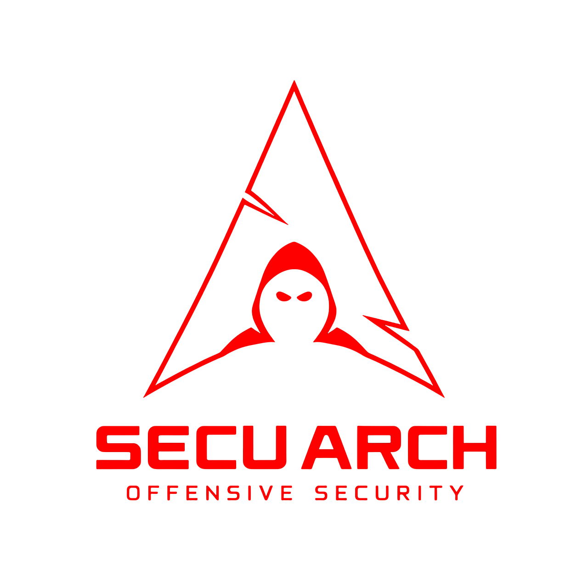

<p align="center">
  
</p>

<!-- PROJECT TITLE & BADGES -->
<h1 align="center">SecuArch: Automated Arch Linux BTRFS Installation for Pentesters</h1>
<p align="center">
  
  
  
  
  
  
</p>

<p align="center">
  An automated Arch Linux install script with a BTRFS layout, focusing on Cyber Security, Penetration Testing, and OffSec tooling.
  <br/>
  <strong>Explore the docs »</strong>
  <br/>
  <a href="#-features">Features</a>
  ·
  <a href="#-prerequisites-before-install">Prerequisites</a>
  ·
  <a href="#-installation-process">Installation</a>
  ·
  <a href="#-known-issues">Known Issues</a>
  ·
  <a href="#-roadmap--future-improvements">Future</a>
</p>

---

## Overview

**SecuArch** is a streamlined, **script-based** installation process for Arch Linux. It automatically sets up **BTRFS** subvolumes, **encrypted partitions** (optional), and pre-installs a curated collection of pentesting and defensive tools. My goal: provide a minimal yet powerful base for cybersecurity professionals, students, and enthusiasts. 

### Why SecuArch?
- **BTRFS** for snapshotting & rollback—great for testing out risky software or experiments.
- **Pentesting Tools** out of the box, inspired by Kali/BlackArch, but with full Arch flexibility.
- **Focus on Security**: optional LUKS encryption, hardened configs, user-friendly scripts.
- **Make it your own**: As a cybersecurity enthusiast, you will have the perfect base to build your own environment and have maximum productivity.
---

## Key Features

- **Automated Partitioning & BTRFS**: Create separate subvolumes for `/root`, `/home`.
- **Optional LUKS Encryption**: Secure your data at rest with full-disk encryption.
- **Pentesting Tools**: Installs essential packages (Metasploit, nmap, Wireshark, sqlmap, etc.).
- **Blue Team & OffSec**: Suricata, OpenVAS, Tor, i2p, Firejail, etc.
- **Customizable**: Pick and choose which tools to install during or after setup.
- **Post-Install Scripts**: Automatic configuration of sudoers, network, display manager, or security tweaks.

---

## Prerequisites (Before Install)

1. **Bootable Arch ISO**: Download from [Arch Linux official site](https://archlinux.org/download/).
2. **Internet Connection**: The script will update mirrors and install packages online.
3. **UEFI or Legacy Mode**: Ensure your system is properly set up to boot in UEFI if you want EFI partitions.
4. **Storage Device**: This script will format your chosen drive. Double-check you’re okay with losing data.

> **Warning**: This installer **wipes** the selected disk. Back up any essential data!

---

## Installation Process
> [!CAUTION]
> The script will ask for you root password several times!

**BARE METAL**
1. **Boot from Arch ISO**  
   Insert your USB and boot the live environment.

**VIRTUAL MACHINE**
1. **Prerequisite**

   - If you're running linux, I recommend QEMU/KVM. It supports TRIM and has less strange bugs than virtualbox (At least in my case). In any case, make sure you have the resources necessary for running a virtual graphical environment.

   - Enable EFI

   - Make sure you have at least 35GB free. If you want a more lightweight distro, eliminate some of the packages in the _packages.txt_ file.
     
   - Enable 3D Acceleration for you virtual machine
  
   - Do not allocate a lot of video memory (more than 1GB), the VM may halt after GRUB selection

---

2. **Clone the Repository**  
   ```bash
   pacman -Syy
   pacman-key --init
   pacman -S git
   git clone https://github.com/pwnish3r/SecuArch.git
   cd SecuArch
   ```
   The _pacman -S git_ may fail a few times, keep trying.
   
3. **Run the installer**
   ```bash
   chmod +x setup.sh
   ./setup.sh
   ```

4. **After Install Scripts**
   The After Install scripts make sure everything is installed and enabled on the system. The first script takes care of the packages and straps BlackArch repo on your system, changes GRUB and SDDM theme. The second script takes care of the actual environment, by installing a Tiling Window Manager.
   > In SDDM login screen, choose i3 if the hyprland environment seems slow to you.
   

> [!CAUTION]
> Choose the following options when prompted when installing the dotfiles for hyprland: input_group gtk_themes Bluetooth thunar ags xdph zsh dots

> [!CAUTION]
> Do not download the wallpapers, my script will delete all of them

> [!CAUTION]
> Choose to reboot when prompted

---

## Known Issues

    1. Nvidia/AMD Drivers: Some laptops with hybrid GPU might 
    need manual driver setup post-install.
    2. Secure Boot: If you have Secure Boot enabled, 
    additional steps or kernel signing might be needed.
    3. Wi-Fi Issues: Network Manager is included, 
    but certain Wi-Fi chipsets may require extra firmware.
    4. Some packages that my installation depends on may be updated and some dependencies 
    change. I will try to test my install script as often as possible to avoid conflicts.
    5. Sometimes the installation of packages just fails, if you see a lot of red errors after
    the first reboot, start from the beginning.

Please report issues or open a pull request if you find a bug or have a workaround!

---

## Roadmap & Future Improvements

    1. Additional Subvolume Layout: Offer advanced 
    partition schemes for containers, logs, etc.
    2. GUI Installer: Possibly build a minimalist 
    curses or web-based front-end.
    3. Extensive Hardening: systemd security profiles, 
    SELinux/AppArmor integration, etc.
    4. Local CTF Lab: Automate spinning up local 
    vulnerable VMs or Docker images for practice.
    5. Customization Wizard: Let users pick from 
    multiple security profiles (Red Team, Blue Team, Reverse Engineering, etc.) during installation.
    6. A more versatile i3WM config out of the box, hacking oriented.

---

## Contributing

Contributions make this project better! To contribute:

    Fork the project
    Create a feature branch (git checkout -b feature/CoolThing)
    Commit your changes (git commit -m "Add some CoolThing")
    Push to the branch (git push origin feature/CoolThing)
    Open a Pull Request
    
